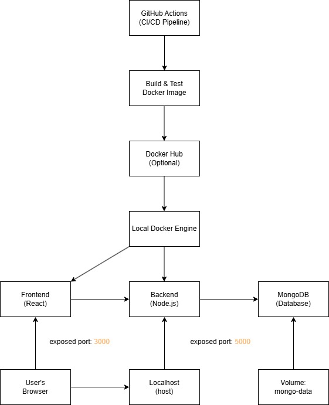

# Week 6: CI/CD Pipeline with Docker, Docker Compose, and GitHub Actions

This document details the containerization of a full-stack application (backend and frontend), its orchestration using Docker Compose, and the setup of a Continuous Integration/Continuous Deployment (CI/CD) pipeline with GitHub Actions.

## Table of Contents

1.  [Project Flow Diagram](#project-flow-diagram)
2.  [Dockerizing Your Project](#dockerizing-your-project)
    *   [Backend Dockerization](#backend-dockerization)
    *   [Frontend Dockerization](#frontend-dockerization)
3.  [Orchestration with Docker Compose](#orchestration-with-docker-compose)
4.  [Enhancements: Health Checks and Image Tagging](#enhancements-health-checks-and-image-tagging)
    *   [Health Checks](#health-checks)
        *   [Frontend Health Check](#frontend-health-check)
        *   [Backend Health Check](#backend-health-check)
    *   [Docker Image Tagging](#docker-image-tagging)
5.  [CI/CD with GitHub Actions](#cicd-with-github-actions)
    *   [Workflow Overview](#workflow-overview)
    *   [Job: `test`](#job-test)
    *   [Job: `build_and_push_docker_images`](#job-build_and_push_docker_images-1)
    *   [Job: `notify`](#job-notify)

## Project Flow Diagram



## Dockerizing Your Project

Containerization with Docker packages applications and their dependencies into isolated, portable environments, ensuring consistency across development, testing, and production stages.

### Backend Dockerization

The backend service (e.g., a Node.js API) is containerized. The `Dockerfile` in the `backend/` directory defines the image:

```dockerfile
FROM node:20-alpine

WORKDIR /app

COPY package*.json ./

RUN npm install --production

COPY . .

EXPOSE 5000

CMD ["npm", "start"]
```

**Building and Running the Backend Image:**

1.  **Build the image** (naming it `backend-image` locally):
    ```bash
    docker build -t backend-image .
    ```
    *(For pushing to Docker Hub, you'd typically use `yourusername/backend-app:tag`)*

2.  **Run the container** (mapping host port 5000 to container port 5000):
    ```bash
    docker run -d -p 5000:5000 backend-image
    ```

### Frontend Dockerization

The frontend service (e.g., a React application) uses a multi-stage `Dockerfile` in the `frontend/` directory. This creates a lean production image by discarding build tools.

```dockerfile
# Stage 1: Build the application
FROM node:20-alpine AS build

WORKDIR /app

COPY package*.json ./
RUN npm install

COPY . .
RUN npm run build

# Stage 2: Serve the application with Nginx
FROM nginx:alpine

# Copy the build output from the 'build' stage
COPY --from=build /app/build /usr/share/nginx/html

# (Optional) Copy a custom Nginx configuration if needed
# COPY nginx.conf /etc/nginx/conf.d/default.conf

EXPOSE 80

CMD ["nginx", "-g", "daemon off;"]
```

**Why Nginx for Frontend?**
Nginx is a lightweight, high-performance web server, ideal for serving static frontend assets efficiently. The placeholder "we're nginx because ..." can be replaced with a more detailed explanation if desired, such as: "We use Nginx because it is a highly efficient and lightweight web server, perfect for serving the static build artifacts of our frontend application. It offers excellent performance and is a standard choice for this purpose."

**Building and Running the Frontend Image:**

1.  **Build the image** (naming it `frontend-image` locally):
    ```bash
    docker build -t frontend-image .
    ```
    *(For pushing to Docker Hub, you'd typically use `yourusername/frontend-app:tag`)*

2.  **Run the container** (mapping host port 3000 to Nginx container port 80):
    ```bash
    docker run -d -p 3000:80 frontend-image
    ```
    *(Note: The original command `docker run -d -p 3000:80 backend-image` was likely a typo and has been corrected to `frontend-image` here for consistency with the section.)*


## Orchestration with Docker Compose

Docker Compose simplifies managing multi-container applications. Services, networks, and volumes are defined in `docker-compose.yml`:

```yaml
version: '3.8'
services:
  backend:
    build: ./backend
    # image: yourusername/backend-app:latest # Recommended for specific tagging
    container_name: backend-app-container # More descriptive container name
    ports:
      - "5000:5000"
    environment:
      - PORT=5000
      # Example: MONGODB_URI: mongodb://mongo:27017/mydatabase
      # Add other necessary environment variables for the backend
    depends_on:
      - mongo # Ensures mongo starts before the backend
    networks:
      - mynet

  frontend:
    build: ./frontend
    # image: yourusername/frontend-app:latest # Recommended for specific tagging
    container_name: frontend-app-container # More descriptive container name
    ports:
      - "3000:80"
    depends_on:
      - backend # Ensures backend is accessible for API calls
    networks:
      - mynet

  mongo:
    image: mongo:latest # Using the official MongoDB image
    container_name: mongo-db-container # More descriptive container name
    ports:
      - "27017:27017" # Map host port to container port for external access if needed
    volumes:
      - mongo-data:/data/db # Persist MongoDB data
    networks:
      - mynet

volumes:
  mongo-data: # Defines a named volume for MongoDB data persistence

networks:
  mynet: # Defines a custom bridge network for inter-service communication
    driver: bridge
```
*(Note: The `container_name` fields were updated for clarity. It's good practice to also include `image` fields with your Docker Hub username and specific tags, e.g., `yourusername/backend-app:1.0.0`, especially when not relying solely on local builds.)*

**Building and Running with Docker Compose:**
To build the images (if they don't exist or if Dockerfiles/contexts have changed) and start all services:
```bash
docker-compose up --build -d
```
*   `docker-compose up`: Starts or restarts services.
*   `--build`: Rebuilds images before starting containers.
*   `-d`: Runs containers in detached (background) mode.

The original command `docker-compose up --build` is also valid and will show logs in the foreground.

## Enhancements: Health Checks and Image Tagging

### Health Checks

Health checks are crucial for ensuring that your containerized applications are running correctly. Docker provides a `HEALTHCHECK` instruction that you can add to your Dockerfiles to define how to test a container to check that it is still working.

#### Frontend Health Check

In the `frontend/Dockerfile`, we added a health check to monitor the Nginx server:

```dockerfile
# Production stage
FROM nginx:alpine

RUN apk add --no-cache curl # Add curl for health check

# Copy built assets from build stage
COPY --from=build /app/build /usr/share/nginx/html

# Copy custom nginx config
COPY nginx.conf /etc/nginx/conf.d/default.conf

EXPOSE 80

# Health check to ensure Nginx is serving content
HEALTHCHECK --interval=30s --timeout=5s --start-period=5s --retries=3 CMD curl --fail http://localhost:80/ || exit 1

CMD ["nginx", "-g", "daemon off;"]
```

- **`RUN apk add --no-cache curl`**: Installs `curl` in the Nginx image, which is needed for the health check command.
- **`HEALTHCHECK --interval=30s --timeout=5s --start-period=5s --retries=3 CMD curl --fail http://localhost:80/ || exit 1`**:
    - `--interval=30s`: Docker will run the health check command every 30 seconds.
    - `--timeout=5s`: If the command takes longer than 5 seconds, it's considered a failure.
    - `--start-period=5s`: Provides a 5-second grace period after the container starts. Health check failures during this period won't count towards the maximum number of retries.
    - `--retries=3`: If the health check fails 3 consecutive times after the start period, the container will be marked as unhealthy.
    - `CMD curl --fail http://localhost:80/ || exit 1`: The actual command. `curl --fail http://localhost:80/` attempts to fetch the root page. If Nginx is running and serving content, this will succeed (exit code 0). If it fails (e.g., Nginx is down or not responding correctly), `curl --fail` will return a non-zero exit code. The `|| exit 1` ensures that if `curl` itself fails for some reason (though `--fail` usually handles HTTP errors), the health check is also marked as failed.

#### Backend Health Check

Similarly, for the backend service, we added a health check in `backend/Dockerfile` to ensure the Node.js application is responsive:

```dockerfile
FROM node:20-alpine

WORKDIR /app

COPY package*.json ./

RUN npm install --production
RUN apk add --no-cache curl # Add curl for health check

COPY . .

EXPOSE 5000

# Health check to ensure the API is responsive
# Ensure your backend has a /api/health endpoint or similar
HEALTHCHECK --interval=30s --timeout=5s --start-period=5s --retries=3 CMD curl -f http://localhost:5000/api/health || exit 1

CMD ["npm", "start"]
```

- **`RUN apk add --no-cache curl`**: Installs `curl` in the Node.js image.
- **`HEALTHCHECK --interval=30s --timeout=5s --start-period=5s --retries=3 CMD curl -f http://localhost:5000/api/health || exit 1`**:
    - The parameters (`--interval`, `--timeout`, `--start-period`, `--retries`) function the same way as in the frontend health check.
    - `CMD curl -f http://localhost:5000/api/health || exit 1`: This command checks a designated health endpoint (e.g., `/api/health`) of your backend service. The `-f` (fail silently) option for `curl` means it will exit with a non-zero status if the HTTP request fails (e.g., 4xx or 5xx response codes) without outputting the error page content. This is suitable for programmatic checks.

By implementing these health checks, Docker can automatically monitor the status of your containers and report if they become unhealthy. This is particularly useful in orchestration environments like Docker Swarm or Kubernetes, which can use health check status to manage containers (e.g., restarting unhealthy ones).

### Docker Image Tagging

Tagging your Docker images is essential for version control and managing deployments. Semantic versioning (e.g., `major.minor.patch` like `1.0.0`, `1.0.1`, `1.1.0`) is a widely adopted standard.

**1. Building and Tagging Images Manually:**

When you build your images, you can assign a tag using the `-t` flag. For local development, you can use simple names. If you plan to share or store them in a registry like Docker Hub, it's good practice to prefix your image names with your Docker Hub username (e.g., `yourusername/backend-app:1.0.0`).

```bash
# For the backend service (local naming, or use your Docker Hub username)
docker build -t backend-app:1.0.0 ./backend

# For the frontend service (local naming, or use your Docker Hub username)
docker build -t frontend-app:1.0.0 ./frontend
```
Replace `1.0.0` with the desired semantic version. The original commands `docker build -t backend-image .` and `docker build -t frontend-image .` are also perfectly fine for local, untagged builds.

**Updating a Specific Service with Docker Compose:**
The following command is used to update and run a specific service (e.g., `backend`) defined in your `docker-compose.yml` file:
```bash
docker-compose up -d --no-deps --build backend
```
Let's break down what each part does:
- `docker-compose up`: This is the standard command to start or restart services defined in your `docker-compose.yml`.
- `-d`: This flag stands for "detached" mode. It runs the containers in the background, so your terminal is free for other commands. Without `-d`, you would see the logs from the containers directly in your terminal.
- `--no-deps`: This flag tells Docker Compose not to start any services that `backend` depends on. For example, if `backend` depends on `mongo`, `mongo` will not be started or restarted automatically with this command. This is useful when you only want to update the `backend` service and its dependencies are already running and up-to-date.
- `--build`: This flag forces Docker Compose to rebuild the image for the specified service before starting the container. In this case, it will rebuild the image for the `backend` service using its Dockerfile. This is useful when you've made changes to the `backend` service's source code or its `Dockerfile`.
- `backend`: This specifies the name of the service (as defined in your `docker-compose.yml`) that you want to bring up and potentially rebuild.

So, in summary, `docker-compose up -d --no-deps --build backend` will rebuild the Docker image for the `backend` service and then start (or restart) only the `backend` service in detached mode, without affecting its dependencies.

**2. Using Tagged Images in `docker-compose.yml`:**

To ensure `docker-compose` uses specific versions of your images, you should update the `services` definitions in your `docker-compose.yml` file to include the `image` field with the tag. When `docker-compose up --build` is run, it will build the Dockerfile in the specified `build` context and then tag the resulting image with the name provided in the `image` field if an `image` name is specified.

```yaml
version: '3.8'
services:
  backend:
    build: ./backend
    image: yourdockerhubusername/backend-app:1.0.0  # Using a specific tagged image
    container_name: backend-app-container
    ports:
      - "5000:5000"
    environment:
      - PORT=5000
    depends_on:
      - mongo
    networks:
      - mynet

  frontend:
    build: ./frontend
    image: yourdockerhubusername/frontend-app:1.0.0 # Using a specific tagged image
    container_name: frontend-app-container
    ports:
      - "3000:80"
    depends_on:
      - backend
    networks:
      - mynet

  mongo:
    image: mongo:latest # External images can also use specific tags
    container_name: mongo-db-container
    ports:
      - "27017:27017"
    volumes:
      - mongo-data:/data/db
    networks:
      - mynet

volumes:
  mongo-data:

networks:
  mynet:
    driver: bridge
```
*(Replace `yourdockerhubusername` with your actual Docker Hub username.)*

**Benefits of Tagging:**

- **Version Control:** Clearly identify different versions of your application.
- **Rollbacks:** Easily roll back to a previous, stable version if a new deployment has issues.
- **Reproducibility:** Ensure that you are running the exact same code in different environments (development, staging, production) by using the same image tag.
- **Clarity in CI/CD:** CI/CD pipelines can be configured to build, tag, and deploy specific versions automatically.

When you release a new version of your application (e.g., after bug fixes or new features), you would typically:
1. Update your code.
2. Increment the version number according to semantic versioning rules (e.g., `1.0.0` -> `1.0.1` for a patch, or `1.0.0` -> `1.1.0` for a minor feature).
3. Rebuild and re-tag your Docker images with the new version (e.g., `yourusername/app-name:new-version`).
4. Update your `docker-compose.yml` to point to the new image tags.
5. Redeploy your application using `docker-compose up --build -d`. The `--build` flag ensures images are rebuilt if their Dockerfile or context has changed and an `image` name isn't explicitly set to pull a pre-built image. If an `image` name *is* set, Docker Compose will attempt to pull it or use a locally built image with that name/tag.

*(This section clarifies the role of tagging and its interaction with Docker Compose.)*


## CI/CD with GitHub Actions

GitHub Actions automates the build, test, and deployment pipeline. The workflow is defined in `.github/workflows/ci-cd.yml`.

### Workflow Overview

The CI/CD pipeline typically includes these jobs:
1.  **`test`**: Runs automated tests for backend and frontend.
2.  **`build_and_push_docker_images`**: Builds Docker images and pushes them to a container registry (e.g., Docker Hub). This job depends on the `test` job's success.
3.  **`notify`**: Sends notifications (e.g., to Discord) about the build status.


### Job: `build_and_push_docker_images`

This job is responsible for building the Docker images for both the frontend and backend applications and then pushing them to Docker Hub. It typically runs after the tests have passed to ensure that only working code is containerized and published.

The YAML for this job in `.github/workflows/ci-cd.yml` looks like this:
```yaml
build_and_push_docker_images:
    runs-on: ubuntu-latest
    needs: test
    steps:
      - name: Checkout Code
        uses: actions/checkout@v4

      - name: Set up Docker Buildx
        uses: docker/setup-buildx-action@v3

      - name: Log in to Docker Hub
        uses: docker/login-action@v3
        with:
          username: ${{ secrets.DOCKERHUB_USERNAME }}
          password: ${{ secrets.DOCKERHUB_TOKEN }}

      - name: Build and push backend Docker image
        uses: docker/build-push-action@v5
        with:
          context: ./backend
          file: ./backend/Dockerfile
          push: true
          tags: |
            ${{ secrets.DOCKERHUB_USERNAME }}/backend-app:latest
            ${{ secrets.DOCKERHUB_USERNAME }}/backend-app:${{ github.sha }}

      - name: Build and push frontend Docker image
        uses: docker/build-push-action@v5
        with:
          context: ./frontend
          file: ./frontend/Dockerfile
          push: true
          tags: |
            ${{ secrets.DOCKERHUB_USERNAME }}/frontend-app:latest
            ${{ secrets.DOCKERHUB_USERNAME }}/frontend-app:${{ github.sha }}
           }}
```

**Breakdown of the `build_and_push_docker_images` job:**

1.  **`runs-on: ubuntu-latest`**: Specifies that the job will run on the latest version of an Ubuntu virtual machine provided by GitHub Actions.
2.  **`needs: test`**: This indicates that the `build_and_push_docker_images` job will only start if the `test` job (defined elsewhere in your workflow) completes successfully. This prevents building and pushing images if the code has known issues.
3.  **`steps:`**: This section contains the sequence of actions the job will perform.
    *   **`name: Checkout Code`**
        *   **`uses: actions/checkout@v4`**: This standard GitHub Action checks out your repository's code into the runner environment, making your codebase (including Dockerfiles and application code) available to subsequent steps.
    *   **`name: Set up Docker Buildx`**
        *   **`uses: docker/setup-buildx-action@v3`**: Docker Buildx is a CLI plugin that extends Docker with features like building for multiple architectures and improved build performance. This step sets up Buildx in the runner, often a prerequisite for advanced Docker build operations in CI/CD.
    *   **`name: Log in to Docker Hub`**
        *   **`uses: docker/login-action@v3`**: This action securely logs into a Docker registry, in this case, Docker Hub.
        *   **`with:`**: Provides inputs to the `docker/login-action`.
            *   `username: ${{ secrets.DOCKERHUB_USERNAME }}`: Your Docker Hub username, stored as a secret in your GitHub repository settings (`Settings > Secrets and variables > Actions`).
            *   `password: ${{ secrets.DOCKERHUB_TOKEN }}`: Your Docker Hub access token (preferred over your password), also stored as a GitHub secret.
        *   Logging in is necessary to push images to your Docker Hub repository.
    *   **`name: Build and push backend Docker image`**
        *   **`uses: docker/build-push-action@v5`**: A powerful Docker action that simplifies building and pushing images.
        *   **`with:`**: Specifies parameters for the backend image.
            *   `context: ./backend`: Sets the build context to the `backend` directory.
            *   `file: ./backend/Dockerfile`: Specifies the path to the backend's Dockerfile.
            *   `push: true`: Pushes the image to the registry after a successful build.
            *   `tags: |`: Defines multiple tags for the image.
                *   `${{ secrets.DOCKERHUB_USERNAME }}/backend-app:latest`: Tags the image as `latest`, usually pointing to the most recent successful build.
                *   `${{ secrets.DOCKERHUB_USERNAME }}/backend-app:${{ github.sha }}`: Tags the image with the Git commit SHA that triggered the workflow, providing precise traceability.
    *   **`name: Build and push frontend Docker image`**
        *   Analogous to the backend image step, but configured for the frontend application.
        *   `context: ./frontend`, `file: ./frontend/Dockerfile`.
        *   Tags: `${{ secrets.DOCKERHUB_USERNAME }}/frontend-app:latest` and `${{ secrets.DOCKERHUB_USERNAME }}/frontend-app:${{ github.sha }}`.

By automating these steps, the CI/CD pipeline ensures that every successful change (e.g., push or merge to the main branch) results in updated, versioned Docker images in Docker Hub, ready for deployment.

